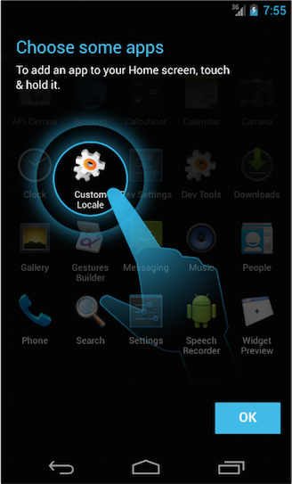
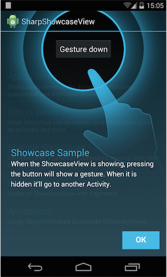

## SharpShowcaseView - Xamarin.Android

This is a port for Xamarin.Android from the well known ShowcaseView of Alex Curran (@amlcurran).
At the moment this port only works on Android 4.x because I am not certain about the need of including a reference to ActionBarSherlock. Also there is some work to do to inherit the C# coding style. For example not all listeners are backed with an event handler yet.

**NOTE:** SharpShowcaseView only works on Android 4.x+ at the moment!

### How to use

I included a sample that explains the straight forward use of SharpShowcaseView.
Simply add the following lines of code at your OnCreate method to add a ShowcaseView to your Xamarin.Android app.

	var configOption = new ShowcaseView.ConfigOptions();
	configOption.HideOnClickOutside = true;

	var target = new ViewTarget(Resource.Id.buttonBlocked, this);
	showcaseView = ShowcaseView.InsertShowcaseView(target, this, Resource.String.showcase_main_title, Resource.String.showcase_main_message, configOption);

I also recomment to take a look at the [ShowcaseView wiki](https://github.com/amlcurran/ShowcaseView/wiki/_pages) for further information.

### Thanks

Big thanks goes to @amlcurran for his initial work on the original Java version of ShowcaseView: https://github.com/amlcurran/ShowcaseView